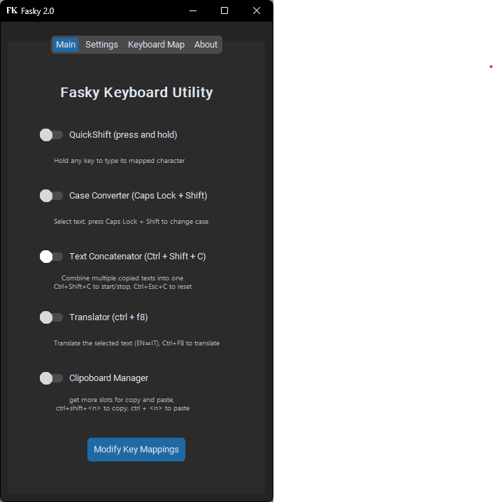
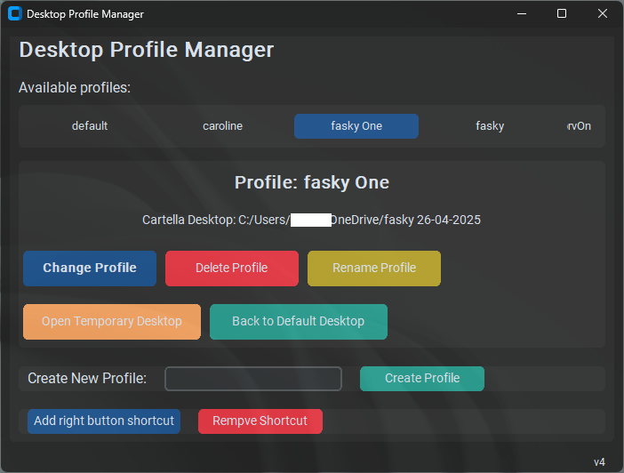

# FASKY 

FASKY is a comprehensive Windows productivity application that enhances your desktop experience with advanced keyboard shortcuts, text manipulation tools, and desktop profile management capabilities.

!!! the keys repetition is blocked by "noreps.exe" a c++ script that block alphanumeric keys (if they are pressed individually, then it does not block repetition if ctrl or other keys are also pressed), i will publish the code soon, now there is the base64 code of the exe in norepsText.py !!!

!!! TO RUN THE CODE YOU NEED TO RUN app.py for the desktop manager + the keyboard functions, faskyMain for only the keyboard functions !!!!
## Features

### Core FASKY Functions (faskyMain.py)
- **QuickShift**: The main function that uses prolonged key pressure to exploit keys as shortcuts. By default, holding a character for more than 0.3s rewrites it in uppercase. Holding numeric characters produces symbols like arrows. All alphanumeric keys are customizable with both characters and entire sentences.
- **Text Concatenator**: Avoids consecutive copy and paste operations. Press `Ctrl+Shift+C` to concatenate all copied text, then release with a simple `Ctrl+V`.
- **Case Converter**: Fixes text case mistakes instantly. Select text and press `Shift + Caps Lock` to convert between uppercase and lowercase (abcd → ABCD).
- **Translator**: Select text and press `Ctrl + F8` to translate between English and Italian with automatic language detection.
- **Clipboard Manager**: Multiple clipboard slots for your notes (still in development with some bugs).



### Desktop Profile Manager (trayEMenu4.py)
- **Profile Management**: Create, save, load, and delete desktop icon layouts and themes
- **Temporary Desktop**: Quickly switch to any folder as a temporary desktop without permanently changing your setup
- **Theme Integration**: Automatically save and restore Windows themes with each profile
- **System Tray Integration**: Full control from the system tray with context menus
- **Registry Integration**: Right-click context menu options for folders to create profiles or open as temporary desktops
- **Profile Automation**: Link desktop profiles with custom automation scripts


## Installation

### Prerequisites
Make sure you have Python installed on your system, then install the required dependencies:

```bash
pip install -r requirements.txt
```

## Usage

### Starting FASKY
for all apps:
```bash
python app.py
```
for only the keyboard functions without the desktop manager:
```bash
python faskyMain.py
```
## Desktop Profile Manager Features

### Profile Management
- **Create Profiles**: Save current desktop icon arrangement, theme, and desktop folder location
- **Load Profiles**: Instantly switch between saved desktop configurations
- **Delete Profiles**: Remove unwanted profiles (default profile cannot be deleted)
- **Rename Profiles**: Change profile names through the UI or tray menu

### Temporary Desktop Mode
- Switch to any folder as desktop without permanently changing your configuration
- Automatically saves current state before switching
- Easy restoration to previous state
- Perfect for project-specific workflows

### System Tray Features
- Persistent background operation
- Quick profile switching from tray menu
- Profile creation and management
- Integration with FASKY automation system

### Profile Components
Each profile saves:
- **Desktop Icon Layout**: Exact positioning of desktop icons
- **Windows Theme**: Current visual theme and wallpaper
- **Desktop Folder**: Custom desktop folder location
- **Registry Settings**: Windows shell configuration
- **Automation Scripts**: Custom actions and shortcuts (when integrated with FASKY)

## Configuration Files

### Profile Storage
Profiles are stored in: `C:\Users\{username}\DesktopProfiles\`

Each profile consists of:
- `{profile_name}.reg` - Desktop icon layout registry data
- `{profile_name}_desktop.txt` - Desktop folder path
- `{profile_name}.theme` - Windows theme file
- `active_profile.txt` - Current active profile tracker

### Automation Integration
- `profiles.json` - Profile automation configurations
- Integration with FASKY's automation system for profile-specific shortcuts and actions

## Keyboard Shortcuts (FASKY Core)

- `Ctrl+Shift+C` - Start/Stop text concatenation mode
- `Shift+Caps Lock` - Convert selected text case
- `Ctrl+F8` - Translate selected text
- Hold any key >0.3s - Trigger QuickShift customization

## Troubleshooting

### Common Issues

**Profile not loading correctly:**
- Ensure you have administrator privileges
- Check if Windows theme files exist
- Verify desktop folder paths are accessible

**Context menu not working:**
- Run application as administrator
- Use `--register` command line option
- Check Windows registry permissions

## Contributing

Pull requests are welcome. For major changes, please open an issue first to discuss what you would like to change.

## License

FASKY © 2025 by Gigio-Bagigio is licensed under [Creative Commons Attribution-NonCommercial 4.0 International](https://creativecommons.org/licenses/by-nc/4.0/).
